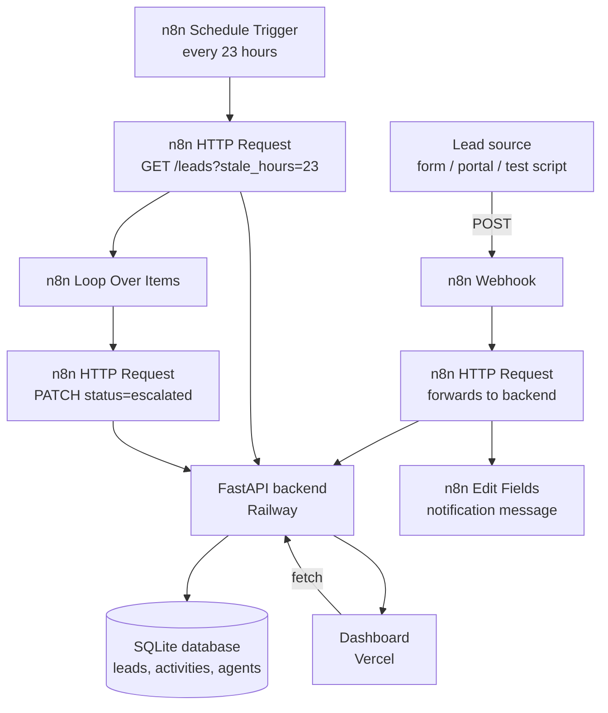

# Dubai Real Estate Lead Automation System

A lead intake, tracking, and escalation system built for the technical assessment. Leads come in through a webhook, get stored and tracked in a backend API, flow through n8n automations for notification and follow-up escalation, and are visible in a live dashboard.

**Live links**
- Backend API (Swagger docs): https://dubai-lead-automation-production.up.railway.app/docs
- Dashboard: https://dubai-lead-automation.vercel.app/
- n8n workflows: published and active (screenshots/exports included below since n8n workflows aren't directly linkable to a public viewer)

---

## Architecture



**Flow, in words:**

1. A new lead is submitted (simulated via curl/Postman for this assessment, but designed to accept a real webhook from a portal or contact form).
2. n8n's webhook trigger catches it and forwards the data to the backend's `/webhook/lead` endpoint, which validates it, stores it in SQLite, and logs a `lead_created` activity.
3. A notification step formats a message confirming the lead was captured (a placeholder for what would be a Slack/email/SMS integration in production).
4. Separately, a scheduled n8n workflow runs periodically, asks the backend for leads that haven't been contacted recently (`GET /leads?stale_hours=23`), and for each one, calls back to `PATCH` its status to `escalated`. The backend automatically logs this status change as an activity.
5. The dashboard is a static page that reads directly from the backend's API — showing all leads, their status, and (on click) their full activity timeline.

---

## Tech stack

| Layer | Choice | Why |
|---|---|---|
| Backend | FastAPI + SQLAlchemy + SQLite | Fast to build, auto-generates interactive API docs, easy to swap SQLite → Postgres later via one env var |
| Automation | n8n (cloud) | Visual workflow builder — avoids hand-rolling retry/scheduling logic for follow-up and escalation |
| Dashboard | Single-file HTML/CSS/JS | No build step, deploys in minutes, easy to review as one file |
| Backend hosting | Railway | Deploys directly from GitHub, free tier sufficient for a demo |
| Dashboard hosting | Vercel | Zero-config static hosting from GitHub |

---

## Project structure

```
.
├── backend/
│   ├── app/
│   │   ├── main.py              # FastAPI app entrypoint
│   │   ├── db/database.py       # SQLAlchemy engine/session setup
│   │   ├── models/models.py     # Lead, Activity, Agent models
│   │   ├── schemas/schemas.py   # Pydantic request/response schemas
│   │   └── routers/
│   │       ├── webhook.py       # POST /webhook/lead (external intake)
│   │       ├── leads.py         # CRUD + activity endpoints
│   │       └── agents.py        # Agent management
│   ├── requirements.txt
│   └── .env.example
└── dashboard/
    └── index.html                # Single-file dashboard, no build step
```

---

## Running locally

**Backend**
```bash
cd backend
pip install -r requirements.txt
cp .env.example .env
uvicorn app.main:app --reload
```
Visit `http://127.0.0.1:8000/docs` for interactive API docs.

**Dashboard**
Just open `dashboard/index.html` directly in a browser — it fetches live from the deployed backend (or edit the `API_BASE` constant at the top of the `<script>` to point at your local backend instead).

---

## API overview

| Method | Endpoint | Purpose |
|---|---|---|
| POST | `/webhook/lead` | External lead intake (used by n8n), protected by a shared-secret header |
| GET | `/leads` | List leads, filterable by `status`, `agent_id`, or `stale_hours` |
| GET | `/leads/{id}` | Lead detail, including full activity timeline |
| POST | `/leads` | Manually create a lead |
| PATCH | `/leads/{id}` | Update status/agent/notes — auto-logs status changes and assignments as activities |
| DELETE | `/leads/{id}` | Remove a lead |
| POST | `/leads/{id}/activities` | Log a call, email, or note against a lead |
| GET/POST | `/agents` | Agent management |

Full interactive documentation is live at `/docs` on the deployed backend.

---

## n8n workflows

**1. Lead Intake & Notification**
`Webhook → HTTP Request (POST to backend) → Edit Fields (format notification message)`
Tested end-to-end with real POST requests; confirmed leads are created correctly in the live database.

**2. Escalation Check**
`Schedule Trigger (every 23h) → HTTP Request (GET stale leads) → Loop Over Items → HTTP Request (PATCH status to escalated)`
Tested with `stale_hours=0` to confirm logic against fresh test data; production interval set to 23 hours as a reasonable default for lead response SLAs (real teams would tune this based on their own follow-up targets).

Both workflows are published and active in n8n.

---

## What's built vs. what I'd add with more time

**Built and working end-to-end:**
- Full backend CRUD, webhook intake, activity auto-logging
- Live deployment (Railway)
- Two working n8n automations against the live backend
- Live dashboard reading real data, with a lead list and per-lead activity timeline

**What I'd add with more time:**
- **Authentication** — the dashboard and most endpoints are currently open; a real system would need agent login and role-based access
- **Real notification integration** — the "notification" step in n8n currently formats a message; production would wire this to Slack, email, or SMS
- **Postgres instead of SQLite** — SQLite is fine for a demo but doesn't persist reliably across redeploys; the codebase already supports swapping via the `DATABASE_URL` env var
- **Agent assignment UI** — agents can be assigned via the API, but the dashboard doesn't yet have a UI for picking/reassigning an agent
- **Tests** — no automated test suite yet; given more time I'd add pytest coverage for the core CRUD and webhook logic
- **Rate limiting / input validation hardening** on the public webhook endpoint beyond the shared-secret check

---

## Notes

This was built end-to-end (including live deployment and working automations) within a tight assessment window. Priority was placed on having every piece actually work against the live, deployed system rather than a polished UI or exhaustive feature set — the sections above are an honest account of what's fully working versus what's scoped but not built.
